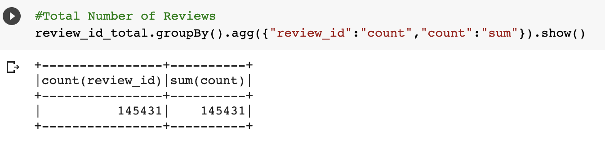
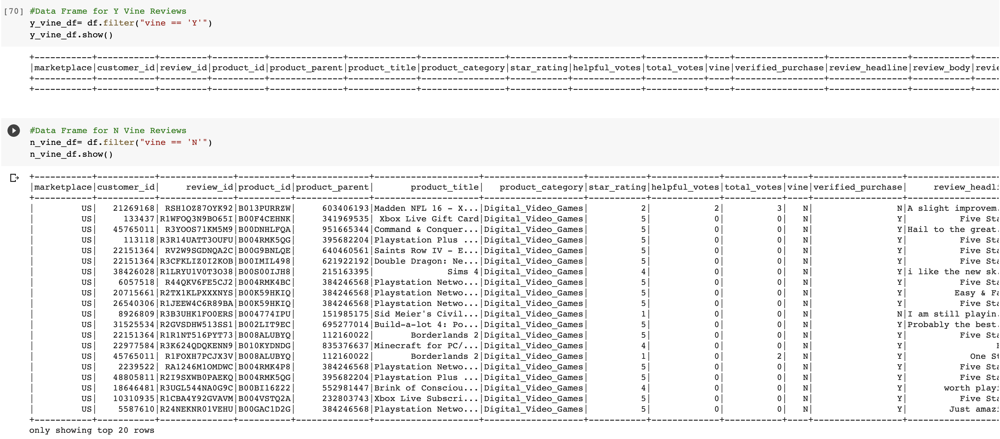
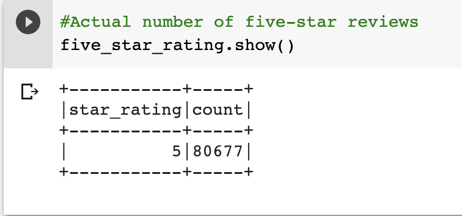
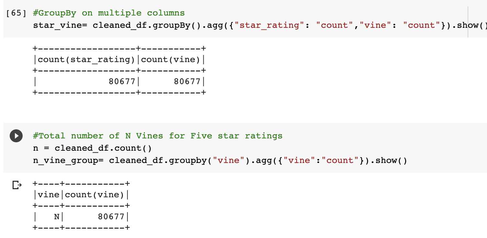
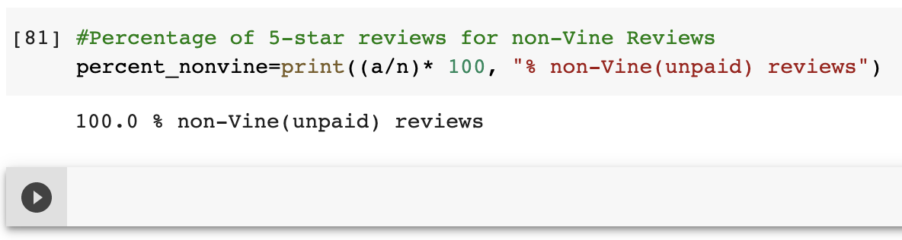
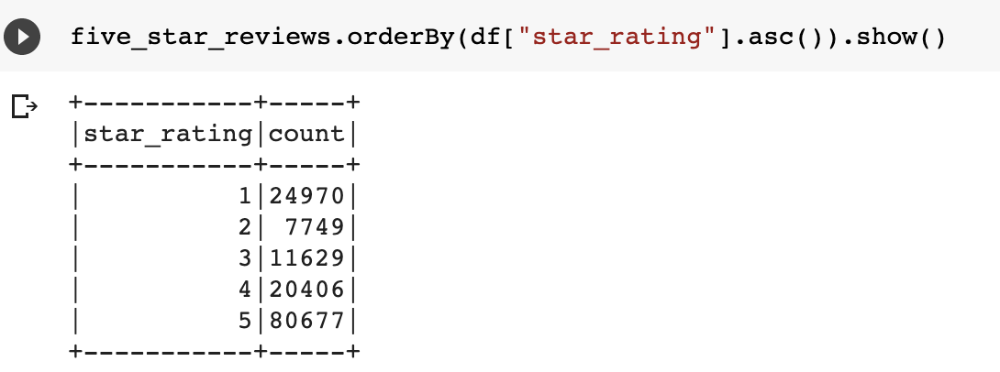
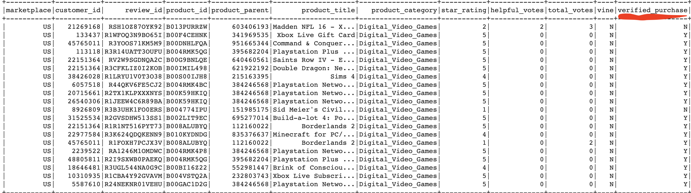

# Amazon_Vine_Analysis

## Overiew of the Amazon_Vine_Analysis

- The purpose of this analysis was utilizing tools as Google Colab and PySpark to handle large datasets and enter the world of Big Data. Using PySpark allowed for a in-depth understanding of the relationship between a cloud database such as Amazon Web Services(AWS) and a open source database such as Postgres have in working together to compute cloud storage data into a database. Understanding this relationship and the capabilities to process large data from cloud storage, allowed for the challenge of analyzing an Amazon customer reviews through various methods such as Pandas, PySparks, and Postgres to create a dataframe extracted from the datasets stored on AWS RDS database. 

## Results 
- Based off the Amazon data set I chose, "https://s3.amazonaws.com/amazon-reviews-pds/tsv/amazon_reviews_us_Video_Games_v1_00.tsv.gz", the results of the number of Vine and non-Vine reviews was astonishing. From my dataframes and data analysis, there were zero Vine (paid-program) reviews. All of the reviews were non-Vine(unpaid program) reviews, and that totaled out to be 145,431 reviews. I am as shocked as you are and I had to double check my code was correct. The image below show my results of there being a total of 145,431 reviews, when creating a dataframe for 'Y' Vine(paid) reviews no data appears, yet when creating a dataframe for 'N' Vine(unpaid) reviews a dataframe is made filled with data.

- There was a total of 80,677 5-star ratings from the Amazon reviews of U.S. Video Games. All of those 80,677 5-star ratings were non-Vine. Images below depict this analysis.

- As previously mentioned, with there being 0 Vine reviews, 0% of the five-star rating were Vine reviews. Therefore, 100% of the 5-star rating were non-Vine reviews.

##Summary

- From what I have learned from this challenge and the dataset I had analyzed, positivity bias for reviews in the Vine program can exist even when there are no Vine(paid) user reviews. The Amazon Reviews for U.S. Video Games dataset upon analysis revealed how the possibility of there being only 'N' or "No" non-Vine(unpaid) user reviews can steer positivity bias towards the glorious 5-star rating. From the image below, the audience can see that with there being only non-Vine user(unpaid) reviews, 5-star ratings had the most at 80,677. 1-star ratings came in with the second fewest selecting that option with 24,970. Therefore, it seems users on an unpaid Vine program generally rated favorably with 5-star ratings. This analysis is skewed due to there miraculously being no Vine (paid) user reviews, but this nonetheless show a positivity bias as the 80,677 out of 145,431 reviews were 5-star ratings, thats nearly 55% of the reviews. 

- An additional analysis that I could've done to support my statement was possibly taking into account another column in the dataset, such as the "Verified_purchase" column. Having this column data included into the filter function, could have potentially extracted more diverse calculations as there isn't just a 'N' variable but also a 'Y' variable present. This analysis could have potentially reduced the positivity bias. 

